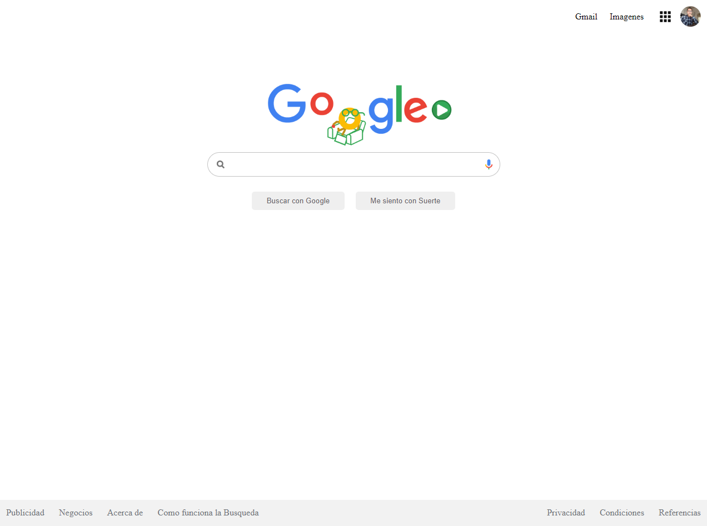

# Google Clon - Layout

Proyect of layout of google, just using HTML and CSS to clone it, is practice for make the page in 2 hours or less

## Demo

You can see the demo live, [here](https://AlexanderAlvarez9.github.io/GoogleClon/index.html)

### Image Preview

### Create for Platzi Master

#### This App is distributed under MIT license.